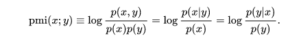
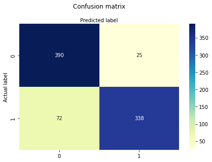
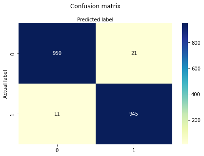

# Identificación de conflicto racial en guiones de películas

# Objectivo
El objetivo principal del proyecto es, dado una serie  de guiones de películas, identificar y clasificar líneas de diálogo racistas.

# Prerrequisitos
 Se recomienda utilizar un entorno virtual como `virtualenv`.
 Luego, instalar mediante pip las librerias que se encuentran en `requeriments.txt`


 `pip install -r requeriments.txt`

# Dataset

Se trabajó principalmente con guiones de películas obtenidas de [The Internet Movie Script Database](https://imsdb.com/) que tratan temas de racismo de distintos géneros (Drama, Comedia, Crimen, etc), contando un total de 
Por otro lado, se tomó una [lista inambigüa de palabras racistas de Wikipedia](https://en.wikipedia.org/wiki/List_of_ethnic_slurs) como semillas de racismo para identificar líneas de diálogo racista.

## Scrapeando guiones de películas

Para obtener los guiones de las películas con las que trabajan las notebooks ejecutar el script `scrap_scripts.py`


`python scrap_scripts.py`

Luego de ejecutar el script se habrá creado un json que contiene los nombres de las películas y los guiones.

# Preprocesamiento

Se trataron los guiones de las películas con Spacy quitando puntuaciones y dígitos principalmente.

# Clustering

Se comenzó explorando los datos mediante clustering para ver si era posible separar palabras racistas de no racistas y se realizaron distintos tipos de clusterings.

## Clustering sobre monogramas

Los guiones fueron lematizados y convertidos en monogramas, tratados con `word2vec` y se aplicó kmeans para sobre 10 clusters sin encontrar agrupamientos significativos de palabras.

## Clustering sobre guiones completos

Luego se trató a los guiones enteros como documentos y se clusterizó sobre ellos utilizando un pipeline con `CountVectorizer`, `TfIdfTransformer` y Kmeans. Al ser un número relativamente corto de documentos el clustering agrupó la mayoría de los documentos en un mismo cluster.

## Clustering sobre líneas de diálogo

Se realizaron dos pipelines de clustering sobre líneas de diálogo; la primera utilizando el mismo pipeline que el de Clustering sobre guiones completos y otro pipeline usando `TfidfVectorizer` y el `Elbow method` para determinar cuál es una buena cantidad de clusters para el proceso.

Cambiando distintos parámetros sobre el primer pipeline fue el que mejores resultados dio agrupando la mayor cantidad de líneas racistas en un mismo cluster.


# Información mutua Puntual

## Información mutua puntual sobre monogramas

Se utilizó la información mutua puntual para poder expandir la lista de palabras semillas racistas y así poder mejorar la clasificación de líneas de diálogo racistas explícitas que se encuentran en los guiones.


Se aplicó la ecuación de PMI dada una palabra p





quedando

```
pmi(p) = log_2 (n de ocurrencias de p en cr / (nro de ocurrencias de p en todo el dataset * nro de palabras en cr) )
```

donde `cr` refiere a contextos racistas. Se consideró que, dada una línea que contuviera al menos una palabra de la lista de semillas racistas se consideraba una línea racista y, por consiguiente que el contexto racista constituía esa línea y dos líneas anteriores y dos líneas posteriores de texto.


Si bien en los resultados de la lista de palabras conseguida por el PMI no es menor a -15.56, se consigue aislar ciertas palabras que hacen referencia a un contexto racista, entre ellas: nigga, devil, slaver, Negroes, bubbas, entre otras.


Posteriormente, tomando las mejores 45 palabras del PMI ordenadas de manera descendente se expandió la lista de semillas racistas.


## Información mutua puntual sobre bigramas

Aplicando la misma fórmula que sobre los unigramas, se crearon bigramas de las distintas líneas de diálogo y se calculó la información mutua puntual sobre ellos. similar a los unigramas, la información mutua puntual no fue mayor a -14.33, pero se pudieron aislar bigramas que hacen referencia a contextos de racismo, por ejemplo: Run nigger, black people, a nigger, entre otros.
Queda como un trabajo futuro clasificar líneas de texto como racistas o no racistas utilizando estos bigramas sacados de PMI.


## Información mutua puntual sobre trigramas

Al igual que en los dos puntos anteriores, se crearon trigramas a partir de las distintas líneas de diálogo, tanto en contextos de diálogo racistas como en contextos no racistas y se aplicó información mutua puntual sobre ellos. Como sucedió con los dos casos anteriores los valores no fueron mayores a -14.39, pero con la particularidad de que no se encontró una cantidad suficiente de trigramas que hagan referencia a contextos de racismo, siendo la mayoría frases que podrían encontrarse en cualquier contexto, por ejemplo: He is a, Have you ever, entre otros. De los pocos trigramas en contextosd racistas que se encontraron han sido; Run nigger run, the black man, nigger run well.


# Clasificación de líneas de diálogo racistas

Utilizando las líneas de diálogo clusterizadas se procedió a clasificar de manera binaria como racistas o no racistas de acuerdo a si la intersección de palabras de la lista de semillas racistas expandida y una línea de diálogo dada es no vacía. La clasificación se guardó como un .csv (`dialog_lines.csv`). Es necesario remarcar que la clasificación es de carácter indicativo y solo tiene en cuenta contextos de racismo explícito (dado que las mayoría de las palabras de la lista semilla de racismo son epítetos racistas), y no tiene en cuenta racismo implícito. e.g. si se tiene una escena donde una persona blanca le dice a una persona negra una línea de diálogo del estilo "no perteneces aquí", sin utilizar peyorativos, entonces esta clasificación la va a pasar por alto.

# Regresión Logística

Finalmente, utilizando la clasificación del punto anterior se entrenó un modelo de regresión logística usando `scikit` partiendo el dataset dado en un conjunto de testeo y otro de entrenamiento, previamente realizando preprocesamiento al texto removiendo puntuaciones y stopwords, así como una vectorización mediante `TfIdfVectorizer`.

Dada la gran desproporción en la cantidad de líneas de diálogo no racistas respecto de las racistas (unas 38014 líneas no racistas y unas 1377 racistas), se utilizó una muestra más pequeña de líneas no racistas para equiparar al de líneas racistas quedando un dataset de 2754 líneas de diálogo para entrenar y testear el modelo.

# Bootstrapping
Luego de aplicar la Regresión Logística con el conjunto de líneas de texto clasificadas se procedió a aplicar resampling de las muestras de las muestras de entrenamiento unas 1000 veces y luego se analizó su precisión y se confeccionó una matriz de Confusión. 

# Resultados

La regresión logística dio una precisión (accuracy) de 0.87, con la siguiente matriz de confusión




El Bootstrapping de la Regresión Logística dio una precisión (accuracy) de 0.5, con la siguiente matriz de confusión





# Conclusiones y trabajos futuros

El trabajo reazliado sobre guiones de películas ayudó a distinguir líneas de diálogo de racismo explícito en diferentes líneas de películas con un grado de precisión decente.


Dentro de los trabajos futuros podría plantearse la expansión del dataset dado que ha quedado en evidencia que la cantidad de guiones con los que se ha trabajado no han sido los suficientes como para dar buenos resultados en lo que respecta a clustering e información mutua puntual.


Otro punto a desarrollar en un trabajo futuro es la expansión de guiones por fuera de Hollywood, los cuales tienden a centrarse en temas de racismo entre blancos y negros sin ahondar tanto en racismo sobre otras culturas, así como el trabajar con racismo implícito, que no necesariamente hace uso de palabras de una lista de semillas de racismo.


# Fuentes y referencias

<https://towardsdatascience.com/clustering-documents-with-python-97314ad6a78d>

<https://towardsdatascience.com/spam-detection-with-logistic-regression-23e3709e522>

<https://github.com/SharmaNatasha/Machine-Learning-using-Python>

<https://scikit-learn.org/stable/modules/generated/sklearn.metrics.confusion_matrix.html>

<https://www.datacamp.com/community/tutorials/understanding-logistic-regression-python>

<https://towardsdatascience.com/logistic-regression-in-classification-model-using-python-machine-learning-dc9573e971d0>

<https://carpentries-incubator.github.io/machine-learning-novice-python/08-bootstrapping/index.html>

